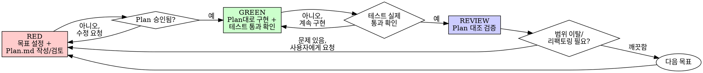

# 테스트 주도 개발 (TDD) — Python / pytest (Plan.md 기반 RED-GREEN-REVIEW)

## 개요

이 프로젝트의 TDD 사이클은 3단계다: **RED**(목표를 정확히 정하고 Plan.md를 검토받는다) → **GREEN**(Plan대로 구현하고 테스트 통과를 직접 확인한다) → **REVIEW**(구현을 Plan과 대조 검증하고, 범위를 벗어났거나 리팩토링이 필요하면 요청한다).

**핵심 원칙:** 승인된 Plan.md와 그 Plan이 정의하는 목표(테스트) 없이 구현을 시작하지 않는다. 구현이 끝났다고 바로 다음으로 넘어가지 않는다 — Plan과 대조하는 REVIEW를 반드시 거친다.

**규칙의 문구를 어기는 것은 규칙의 정신을 어기는 것이다.**

## 언제 사용하는가

**항상:**
- 새로운 기능
- 버그 수정
- 리팩터링
- 동작 변경

**예외 (사용자에게 확인 필요):**
- 일회성 프로토타입
- 자동 생성된 코드 (e.g. protobuf/OpenAPI 산출물)
- 빌드/설정 파일

"이번 한 번만 Plan.md 없이 바로 짜자"는 생각이 든다면? 멈춰라. 그것은 합리화다.

## 절대 법칙

```
승인된 Plan.md 없이 프로덕션 코드를 작성하지 말 것
```

Plan.md 검토 전에 코드부터 작성했는가? 삭제하라. RED부터 다시 시작하라.

**예외 없음:**
- "일단 짜보고 나중에 Plan에 끼워 맞추자" 금지
- Plan에 없는 기능을 "하는 김에" 추가하지 마라
- 승인 없이 구현을 진행하지 마라
- 삭제는 삭제다

## RED — GREEN — REVIEW 사이클



### RED — 목표 정확히 설정 + Plan.md 검토

1. 이번에 구현할 동작(목표)을 하나, 좁고 정확하게 정의한다. "무엇을" "왜" "어떻게 완료를 판단하는지"(어떤 테스트로 검증할지)까지 구체화한다.
2. `Plan.md`를 생성한다 (또는 사용자에게 생성을 요청한다). 최소한 다음을 포함한다:
   - **목표**: 이번 단계에서 구현할 동작 한 가지
   - **완료 기준 / 검증 테스트**: 테스트 이름, 입력값, 기대값 — 이 테스트가 통과하면 목표 달성으로 간주
   - **구현 범위**: 수정/생성할 파일, 함수, 클래스
   - **범위 밖**: 이번 단계에서 절대 하지 않을 것 (다음 Plan으로 미룰 것)
3. Plan.md를 사용자에게 제시하고 **검토·승인을 받는다.** 승인 전에는 프로덕션 코드를 한 줄도 쓰지 않는다.
4. 승인된 Plan의 완료 기준을 표현하는 테스트를 작성한다. 가능하면 먼저 실행해 실패를 확인한다 (구현이 없어서 실패해야 한다 — import 오류나 오타가 아니라).

<Good Plan.md>
```markdown
## 목표
스트라이크(첫 투구 10핀) 프레임의 보너스로 다음 두 투구의 핀 수를 더한다.

## 완료 기준
- 테스트: test_strike_adds_next_two_rolls_as_bonus
- 입력: roll(10), roll(3), roll(4), 나머지는 0
- 기대값: score() == 10 + 3 + 4 + (나머지 프레임 합) == 17 + 7 == 24

## 구현 범위
- game.py의 Game.score() 내부 프레임 순회 로직에 스트라이크 분기 추가

## 범위 밖
- 10번 프레임의 필볼 처리 (다음 Plan에서 다룸)
- 스페어 처리 (이미 이전 Plan에서 구현됨, 건드리지 않음)
```
좁은 목표 하나, 구체적 완료 기준(테스트로 표현), 범위 밖을 명시해 스코프 크리프를 미리 차단
</Good Plan.md>

<Bad Plan.md>
```markdown
## 목표
점수 계산 로직 개선

## 완료 기준
잘 동작하면 됨
```
너무 넓고 모호함, 테스트로 검증 가능한 완료 기준이 없음, 범위 밖 명시 없음 — 무엇이든 구현될 수 있다
</Bad Plan.md>

### GREEN — Plan대로 구현 + 테스트 통과 확인

1. **승인된 Plan.md에 적힌 범위만** 구현한다. Plan에 없는 기능·개선·리팩토링을 슬쩍 끼워 넣지 않는다.
2. Plan의 완료 기준 테스트를 실제로 실행해 통과하는지 확인한다.
3. 전체 테스트 스위트를 실행해 다른 테스트가 깨지지 않았는지 확인한다.

```powershell
# Plan의 완료 기준 테스트만 먼저 확인
.venv\Scripts\python.exe -m pytest tests\test_game.py::test_strike_adds_next_two_rolls_as_bonus -v

# 전체 회귀 확인
.venv\Scripts\python.exe -m pytest
```

확인할 것:
- Plan에 적힌 테스트가 실제로 통과하는가 (직접 실행 결과를 봐야 한다 — 통과했을 것이라고 가정하지 마라)
- 다른 기존 테스트도 여전히 통과하는가
- 출력이 깨끗한가 (경고 없음)

**테스트가 실패한다고?** 코드를 고쳐라. 계속 GREEN 단계에 머문다.

**Plan에 없던 걸 구현하고 싶어졌다고?** 지금 하지 마라. REVIEW에서 발견하고, 필요하면 새 Plan(RED)으로 분리하라.

### REVIEW — Plan 대비 구현 검증

GREEN에서 작성된 코드(diff)를 Plan.md와 나란히 놓고 검토한다.

1. **범위 검증**: Plan에 없는 파일 변경, 함수, 리팩토링이 섞여 들어갔는가?
   - 있다면: 그 변경을 제거하거나, 별도 Plan(다음 RED)으로 분리할지 사용자에게 확인받는다. 조용히 남겨두지 않는다.
2. **완료 기준 검증**: Plan에 적힌 완료 기준 테스트가 정말로 그 동작을 검증하는가, 아니면 우회해서 통과했는가?
3. **리팩토링 필요 여부 판단**: 중복, 이름, 구조상 정리가 필요해 보이면 — **직접 고치지 말고** 무엇을, 왜 리팩토링하면 좋을지 사용자에게 요청/확인한다. 승인되면 이것이 다음 RED의 Plan이 된다.
4. REVIEW가 끝나야 다음 목표(RED)로 넘어간다. REVIEW를 건너뛰고 바로 다음 기능으로 가지 않는다.

## 좋은 테스트

| 품질 | 좋음 | 나쁨 |
|------|------|------|
| **최소** | 한 가지만. 이름에 `and`가 있나? 분리하라. | `test_validates_email_and_domain_and_whitespace` |
| **명확** | 이름이 동작을 설명한다 | `test_1`, `test_basic` |
| **Plan과 일치** | Plan.md의 완료 기준과 테스트 이름/내용이 대응한다 | 테스트가 Plan에 없던 것을 검증한다 |

```python
def test_behavior_description_in_snake_case():
    ...

class TestSuiteName:
    def test_throws_when_input_is_empty(self):
        ...
```

## 순서가 중요한 이유

**"Plan.md 없이 바로 구현하면 더 빠르지 않나"**

Plan 없이 시작하면 목표가 구현 중에 계속 바뀐다. 무엇을 만들지 코드를 쓰면서 정하게 되고:
- 완료 기준이 사후에 코드에 맞춰 정해진다 (요구사항이 아니라 결과를 정당화)
- 범위가 슬금슬금 넓어져도 알아채기 어렵다 (기준이 없으므로)
- 리뷰할 때 "원래 뭘 하려던 거였는지" 재구성해야 한다

Plan 우선은 목표를 구현 전에 고정시키고, REVIEW가 그 목표와 실제 결과를 객관적으로 비교할 수 있게 한다.

**"리뷰 단계에서 발견한 문제, 그냥 내가 고치고 넘어가면 안 되나"**

안 된다. 사용자 확인 없이 고치면 그 변경 자체가 계획되지 않은 것이다 — Plan 없는 구현과 동일한 문제를 반복하는 것이다. REVIEW의 역할은 "고치기"가 아니라 "발견하고 요청하기"다.

**"Plan에 없지만 하는 김에 이것도 고치자"**

스코프 크리프다. 사용자가 승인한 것은 Plan에 적힌 범위뿐이다. 나중에 별도 Plan(RED)으로 제안하라.

**"테스트는 GREEN 끝나고 한 번에 몰아서 확인하면 되지 않나"**

즉시 통과 여부를 확인하지 않으면, 무엇이 실제로 동작을 검증하는지와 우연히 통과한 것을 구분할 수 없다. Plan의 완료 기준 테스트는 GREEN 단계 안에서 직접 실행해 확인한다.

## 흔한 합리화

| 변명 | 현실 |
|------|------|
| "간단한 수정인데 Plan.md까지 필요한가" | 간단해도 목표를 문서화하는 데 30초면 된다. 간단하다는 판단 자체가 주관적이다. |
| "Plan 검토는 나중에 받고 일단 짜자" | 승인 전 구현은 잘못된 방향으로 갔을 때 되돌리는 비용을 키운다. |
| "리뷰에서 찾은 문제는 내가 알아서 고친다" | 계획 없는 변경이다. 먼저 알리고 확인받는다. |
| "Plan에 없지만 하는 김에 이것도" | 스코프 크리프. 별도 Plan으로 분리하라. |
| "테스트 통과는 눈으로 코드 보면 안다" | 실제로 실행한 결과와 추측은 다르다. 반드시 실행하라. |
| "REVIEW는 건너뛰고 다음 기능으로" | REVIEW를 생략하면 스코프 크리프와 미완료 리팩토링이 계속 쌓인다. |

## 위험 신호 — 멈추고 RED로 돌아가라

- Plan.md 없이 시작된 구현
- Plan.md가 검토/승인되지 않았는데 진행된 구현
- GREEN 단계에서 Plan에 없는 기능이 몰래 추가됨
- REVIEW 단계를 생략하고 바로 다음 목표로 이동
- REVIEW에서 발견한 문제를 사용자 확인 없이 임의로 리팩토링
- "이번엔 Plan 없이 가도 될 것 같다"는 판단

**이 모든 것의 의미: 지금 멈추고, Plan.md를 작성/검토받는 RED부터 다시 시작하라.**

## 예시: 버그 수정

**버그:** 빈 이메일이 허용됨

**RED — Plan.md**
```markdown
## 목표
FormService.submit_form이 빈 이메일을 거부하도록 한다.

## 완료 기준
- 테스트: test_rejects_empty_email
- 입력: FormData(email="")
- 기대값: result.ok is False, result.error == "Email required"

## 구현 범위
- form_service.py의 submit_form 함수에 빈 이메일 검증 추가

## 범위 밖
- 이메일 형식(도메인, @ 포함 여부) 검증은 다루지 않음
```
(사용자 검토·승인 후 진행)

**RED — 테스트 작성 및 실패 확인**
```python
# test_form_service.py
from form_service import submit_form, FormData


def test_rejects_empty_email():
    data = FormData(email="")

    result = submit_form(data)

    assert result.ok is False
    assert result.error == "Email required"
```
```text
$ .venv\Scripts\python.exe -m pytest tests\test_form_service.py::test_rejects_empty_email -v
FAILED tests/test_form_service.py::test_rejects_empty_email
AssertionError: assert None == 'Email required'
```

**GREEN**
```python
# form_service.py
from dataclasses import dataclass


@dataclass
class FormData:
    email: str


@dataclass
class Result:
    ok: bool
    error: str | None = None


def submit_form(data: FormData) -> Result:
    if not data.email.strip():
        return Result(ok=False, error="Email required")
    return Result(ok=True)
```
```text
$ .venv\Scripts\python.exe -m pytest tests\test_form_service.py::test_rejects_empty_email -v
PASSED tests/test_form_service.py::test_rejects_empty_email
```

**REVIEW**
- 범위 검증: Plan에 명시된 파일(form_service.py)만 수정됨, 이메일 형식 검증은 추가하지 않음 → 통과
- 완료 기준 검증: 테스트가 실제로 빈 이메일 케이스를 검증함 → 통과
- 리팩토링: 필드가 늘어날 예정이면 검증 로직 분리를 다음 Plan으로 제안할 수 있음 (지금은 불필요 판단)

## mock/monkeypatch 사용 시 (불가피한 경우)

외부 의존성(파일 시스템, 네트워크, 시간)이 있을 때만 mock을 사용한다. Plan.md의 구현 범위에 어떤 의존성을 어떻게 mock할지 미리 적어두면 REVIEW에서 판단하기 쉽다.

```python
# test_token.py
from datetime import datetime, timedelta
from unittest.mock import Mock

from token_factory import create_token


def test_expires_after_one_hour():
    clock = Mock()
    t0 = datetime.now()
    clock.now.side_effect = [t0, t0 + timedelta(hours=1, seconds=1)]

    token = create_token(clock)

    assert token.is_valid(clock) is True
    assert token.is_valid(clock) is False  # 1시간 1초 경과 후
```

mock으로 테스트를 도배하지 마라. 의존성이 자연스럽게 주입되도록 설계가 안 되어 있다면, mock이 아니라 설계를 고쳐라 (예: 시간/파일/네트워크를 인자로 주입) — 이런 설계 변경도 Plan.md에 명시하고 REVIEW로 확인한다.

## pytest 실용 명령어

```powershell
# 가상환경 활성화 (없다면 먼저 pytest 설치)
.\.venv\Scripts\Activate.ps1
pip install pytest pytest-mock

# 전체 테스트
.venv\Scripts\python.exe -m pytest

# 특정 파일 / 특정 테스트만
.venv\Scripts\python.exe -m pytest tests\test_game.py
.venv\Scripts\python.exe -m pytest tests\test_game.py::test_gutter_game_scores_zero

# 이름으로 필터링
.venv\Scripts\python.exe -m pytest -k "spare"

# 실패한 테스트만 다시 실행
.venv\Scripts\python.exe -m pytest --lf

# 첫 실패에서 즉시 중단 + 상세 출력
.venv\Scripts\python.exe -m pytest -x -v

# 경고를 에러로 승격 (깨끗한 출력 확인)
.venv\Scripts\python.exe -m pytest -W error

# 커버리지 확인 (pytest-cov 설치 시)
.venv\Scripts\python.exe -m pytest --cov=. --cov-report=term-missing
```

`pyproject.toml` 최소 설정 예시:

```toml
[tool.pytest.ini_options]
testpaths = ["tests"]
python_files = ["test_*.py"]
pythonpath = ["."]
```

## 검증 체크리스트

작업을 완료로 표시하기 전에:

- [ ] RED: 목표가 하나로 좁게 정의되었다
- [ ] RED: Plan.md가 작성되고 사용자 검토·승인을 받았다
- [ ] RED: Plan의 완료 기준을 표현하는 테스트가 있고, 실패를 직접 확인했다
- [ ] GREEN: 승인된 Plan 범위 내에서만 구현했다
- [ ] GREEN: Plan의 완료 기준 테스트가 실제로 통과하는 것을 확인했다 (`pytest`)
- [ ] GREEN: 전체 테스트 스위트가 통과한다, 출력이 깨끗하다
- [ ] REVIEW: 구현을 Plan.md와 대조해 범위 이탈이 없는지 확인했다
- [ ] REVIEW: 리팩토링 필요 여부를 판단하고, 필요하면 사용자에게 요청했다 (임의로 고치지 않았다)

모두 체크할 수 없다면? 이 워크플로우를 건너뛴 것이다. RED로 돌아가라.

## 막힐 때

| 문제 | 해결 |
|------|------|
| Plan.md에 뭘 적어야 할지 모르겠다 | 원하는 API와 완료 기준 테스트부터 적어보라. 사용자에게 물어보라. |
| 테스트가 너무 복잡하다 | 설계가 너무 복잡하다. 인터페이스를 단순화하라 (Plan.md에 이 리팩토링을 별도로 적어 제안하라). |
| 모든 것을 mock해야 한다 | 코드가 너무 결합되어 있다. 의존성 주입을 사용하라. |
| 테스트 셋업이 너무 크다 | pytest `fixture`로 공통 셋업을 추출하라. |
| 전역 상태/싱글턴 때문에 테스트 어려움 | 전역 상태를 인스턴스나 인자로 옮기고 주입하라. |
| 같은 동작을 여러 입력으로 검증해야 함 | `@pytest.mark.parametrize` 사용. |
| REVIEW 중에 큰 문제를 발견했다 | 고치지 말고 사용자에게 보고하라. 승인되면 새 Plan(RED)으로 다룬다. |

## 디버깅과의 통합

버그를 발견했나? RED부터 시작한다: 버그를 재현하는 Plan.md(목표 = 이 버그가 사라짐, 완료 기준 = 재현 테스트가 통과)를 작성하고 검토받은 뒤, 그 테스트를 작성해 실패를 확인하고 진행한다.

Plan과 테스트 없이 버그를 고치지 마라.

## 테스트 안티패턴

mock이나 테스트 유틸리티를 추가할 때, 흔한 함정을 피하기 위해 점검하라:
- 실제 동작이 아닌 mock의 동작을 테스트하기
- 의존성을 이해하지 않고 mock하기
- 호출 횟수(`mock.assert_called_once()`)만 검증하고 결과는 검증하지 않기
- private 속성(`_attr`)에 직접 접근해 캡슐화 깨기

pytest에서 추가로 유용한 것들:
- `@pytest.fixture` — 공통 셋업이 필요한 테스트
- `@pytest.mark.parametrize` — 같은 동작을 여러 입력으로 검증하는 파라미터화된 테스트
- `pytest.raises(ExceptionType)` — 예외 동작 검증
- `pytest.approx` — 부동소수점 비교
- `-k` / `-m` — 테스트 이름/마커로 선택 실행

## 최종 규칙

```
프로덕션 코드 → 승인된 Plan.md + 그 Plan이 정의한 실패 테스트가 먼저 존재한다
구현 완료 → REVIEW로 Plan과 대조 검증한 뒤에만 다음 목표로 넘어간다
그렇지 않으면 → 이 워크플로우가 아니다
```

사용자의 명시적인 허락 없이는 예외 없음.
